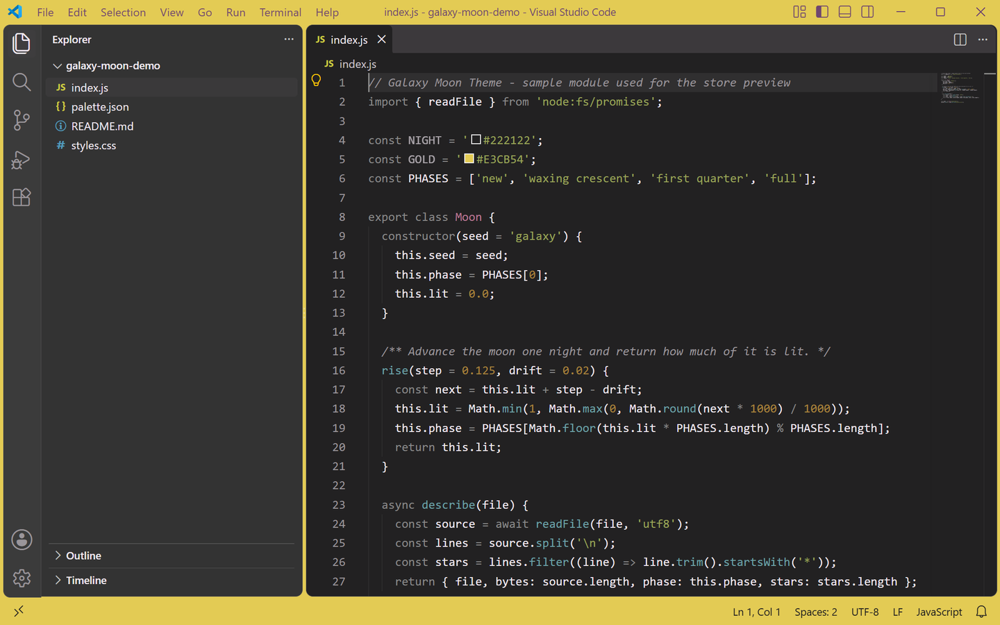
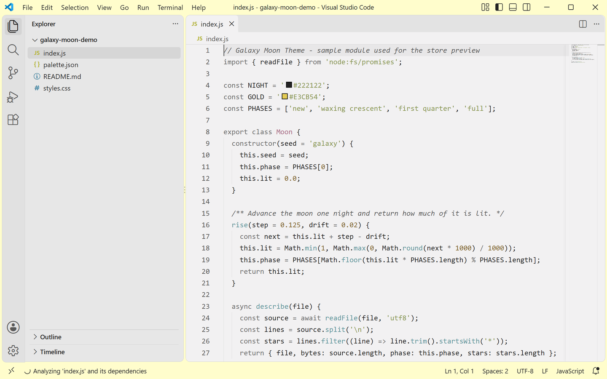

<p align="center">
  
</p>

<h1 align="center">Galaxy Moon Theme</h1>

<p align="center">
  A moonlit color theme for Visual Studio Code: warm gold accents over a deep night sky,
  with a lavender tinted light variant.
</p>

<p align="center">
  <a href="https://marketplace.visualstudio.com/items?itemName=lilinhuang.galaxy-moon-theme">
    
  </a>
  <a href="https://github.com/vaxicy/galaxy-moon-theme/blob/master/LICENSE">
    
  </a>
</p>

## Previews

<p align="center">
  
  
</p>

Left is the dark variant, right is the light variant. Both are rendered straight from the
two theme JSON files: a 1280x800 mockup of the workbench is built from the shipped colors
and captured with a headless browser, then sampled back against the JSON. The two shots
share one layout, so they are directly comparable.

## Introduction

Galaxy Moon Theme is a two-variant color theme built around one idea: a single crescent
of light in a dark sky. The dark variant keeps the workbench on a near black neutral
canvas and lets one warm gold carry the interface, while the light variant swaps the
night for a soft porcelain canvas and a moon cream tint.

The extension ships two selectable variants from one visual family:

- **Galaxy Moon Theme Dark** — a near black canvas (`#222122`) with lavender white text, a gold title bar and status bar, and a grey activity bar.
- **Galaxy Moon Theme Light** — a porcelain canvas (`#F2F1F2`) with near black text and a moon cream title bar (`#FFFDCC`).

Neither variant uses more than a handful of hues: gold marks the interface, sage, amber,
rose and teal only ever appear inside the code itself.

## Palette

| Role | Light | Dark | Name |
| --- | --- | --- | --- |
| Editor canvas | `#F2F1F2` | `#222122` | porcelain / night |
| Side bar | `#E7E7E7` | `#333333` | haze layer |
| Title bar | `#FFFDCC` | `#E3CB54` | moon cream / gold |
| Selection | `#CCCCCC` | `#3F3E3F` | soft grey |
| Accent | `#6C6C6C` | `#E3CB54` | slate / gold |
| Primary action | `#7E6320` | `#E3CB54` | bronze gold / gold |
| Foreground | `#232323` | `#F1E9F1` | ink / lavender |

## Syntax

Comments stay quiet and italic (`#595959` / `#9A959A`), keywords and tags keep the
neutral accent (`#6C6C6C` / `#898989`), strings use a muted sage (`#5F6B2E` / `#9AA458`),
numbers and attributes a warm amber (`#83662E` / `#B18B3D`), types and classes a dusty
rose (`#8E4A69` / `#B97995`), and functions a soft teal (`#3F6E74` / `#6DA2A8`).
Semantic highlighting is enabled, so TypeScript, JavaScript and Python pick up accurate
class, interface, enum, function, method, parameter, property and variable colors on top
of the TextMate rules.

Every syntax hue is deliberately desaturated, so a file full of code never fights the
gold workbench for attention - and every one of them still clears 4.5:1 against the
editor canvas, so desaturated never means washed out.

## Installation

1. Open the Extensions view (`Ctrl+Shift+X` / `Cmd+Shift+X`).
2. Search for `Galaxy Moon Theme`.
3. Click **Install**.

Or install from the command line:

```
code --install-extension lilinhuang.galaxy-moon-theme
```

## Usage

1. Open the Command Palette (`Ctrl+Shift+P` / `Cmd+Shift+P`).
2. Run **Preferences: Color Theme** (or `Ctrl+K Ctrl+T`).
3. Pick **Galaxy Moon Theme Light** or **Galaxy Moon Theme Dark**.

## Notes

- Both variants theme the whole workbench, not only the editor: activity bar, side bar,
  tabs, panels, terminal, command list, quick input, widgets, badges, inputs,
  notifications, diffs and Git decorations.
- Contrast was audited color by color: every text pair clears WCAG AA (4.5:1), every
  interface element such as the cursor, focus border, scrollbar and find highlight clears
  3:1, and so does every syntax token and ANSI color. `scripts/audit-contrast.py` runs the
  same check over both variants, so a hand edited color cannot quietly regress.
- A matching 16 color ANSI palette keeps the integrated terminal in the same family.
- Chat, markdown and other embedded extension panels get the full set of content colors
  (inline code, code blocks, block quotes, separators and secondary buttons), so they do
  not quietly fall back to the default palette of VS Code.
- The gold title bar and status bar are the signature of the dark variant; if you prefer
  a fully neutral window, the light variant stays quiet from top to bottom.
- The README previews are generated from the shipped theme JSON files by
  `scripts/generate-store-screenshots.py`, so what you see is exactly what the theme
  defines - and the script samples pixels back out of the rendered image to prove it.
- The base palette was generated with [ThemeBake](https://themebake.pages.dev).

## Development

Open this folder in VS Code and press **F5** to launch an Extension Development Host
with the theme applied.

To regenerate the README previews:

```
python3 scripts/generate-store-screenshots.py
```

The script builds a 1280x800 HTML mockup of the workbench from the two theme JSON files,
screenshots it with headless Chromium through Playwright, writes both variants into
`store-assets/screenshots/en/`, and finally samples a few pixels back out of each shot to
verify they still match the JSON.

The extension icon and the logo candidates under `assets/` are drawn from code:

```
python3 scripts/generate-logo-candidates.py
```

To re-check contrast after editing a color:

```
python3 scripts/audit-contrast.py
```

## Feedback

Suggestions and issues are welcome — please open an issue or pull request on the
project repository.

## License

MIT — see [LICENSE](https://github.com/vaxicy/galaxy-moon-theme/blob/master/LICENSE).
